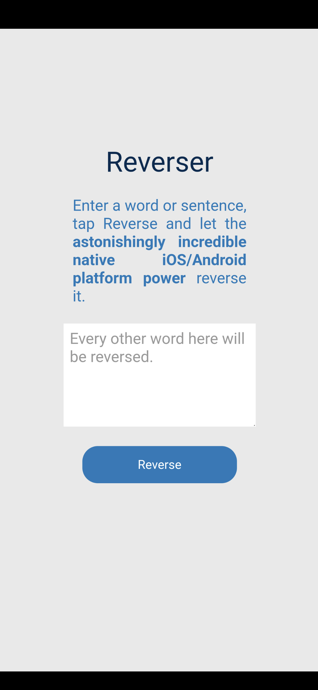
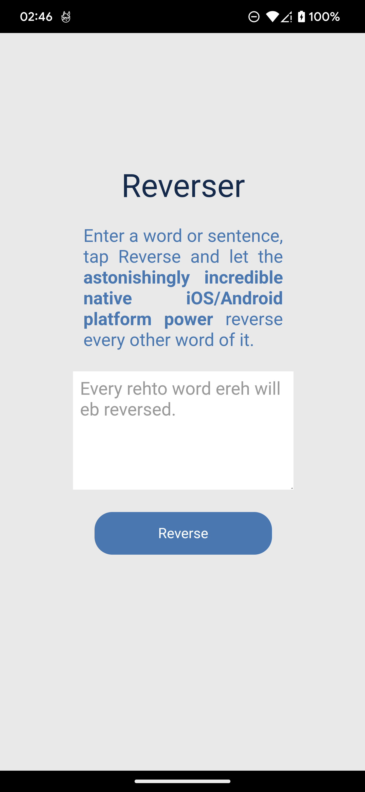
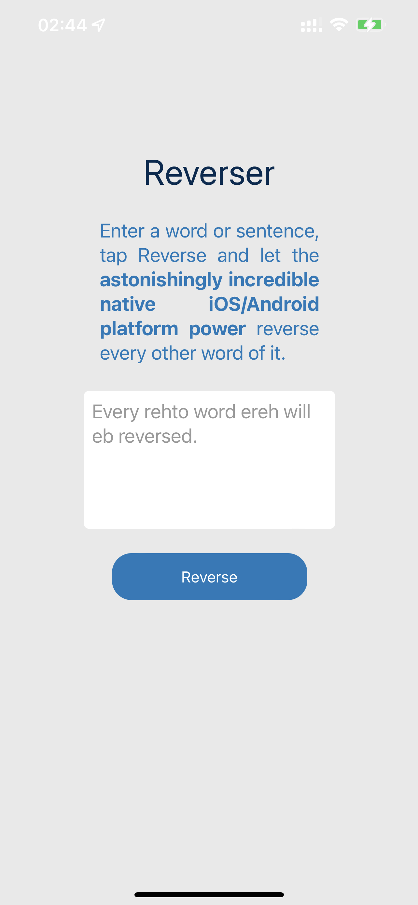

# Reverser App and Plugin

This repository contains a simple cordova app and a plugin that reverses every other word of a sentence.


### Plugin

Name: reverserplugin
Package: dev.oscarsalguero.reverserplugin
Folder: reverserplugin

1. Receives user input, a sentence (String) from the app, consisting of a sentence and uses native code in Java for Android or Objective-C for iOS to reverse every other word in that sentence.

2. Returns the processed otput to the app's UI to show it to the user.


### Reverser App

1. Capture user input trough a text area and send it to the cordova plugin.

2. Display the output or result received from the plugin.

Supported platforms:

- Android
- iOS


#### Android Details:

- Activity: MainActivity
- Android target: android-30
- Created with: cordova-android@10.1.2

<br>


Android App Launcher Icon

<br>



Android App UI With Sample Input

<br>



Android App Input Reversed By Plugin

<br>

#### iOS Details:

- Created with: cordova-ios@6.2.0

<br>


iOS App Launcher Icon

<br>


iOS App UI With Sample Input

<br>



iOS App Input Reversed By Plugin

<br>
<br>


# How To Use

Clone this repo:

```
git clone https://github.com/RacZo/cordova-plugin-reverser.git reverser
```

The sample app source will be in the root of the repository folder: 

```
reverser
```

The plugin's source code is in: 

```
reverser/reverserplugin
```


To add the plugin:

```
cordova plugin add file:./reverserplugin
```

To remove the plugin:

```
cordova plugin remove dev.oscarsalguero.reverserplugin
```

